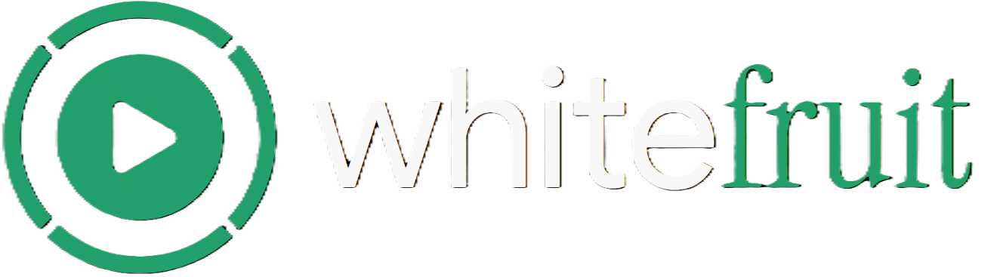

<h3 align="center">Sync your Youtube Music playlists to iTunes.</h3>

## Features

- **Download** whole YouTube Music playlists as tagged, iPod-ready files -
  title, artist, album, track number and cover art, and playlist order all configured.
- **iTunes sync** each playlist over COM, ready for iPod plugin.
- **Deduplicate** repeated songs between playlists, while still maintaining playlist continuity.
- **Re-encode** an existing library to a different format without
  redownloading it.

## Setup

Requires `yt-dlp`, `ffmpeg`, and classic iTunes with
COM automation, all on Windows. Both `yt-dlp` and `ffmpeg` need to be on
`PATH` (or edit `YTDLP_FALLBACK` in `whitefruit/download.py`).

Playlist URLs are listed in `playlists.txt`. 

## iPod support

whitefruit doesn't interface with your iPod's file system, so all iTunes-syncable iPods are supported. This includes:

- iPod Classic (1st–7th)
- iPod nano (1st–7th)
- iPod mini (1st-2nd),
- iPod shuffle (1st–4th)
- iPod video (5th)
- iPod touch (1st-7th)
- all iTunes capable iDevices

### Music Formats

| Format | Setting | Notes |
| --- | --- | --- |
| MP3 (LAME) | `mp3` *(default)* | Plays on every iPod ever made. The safe choice. |
| AAC | `m4a` | Smaller at the same quality, but see warning below. |
| Apple Lossless | `alac` | 4th gen and newer only. Very large files, and older hardware can struggle to keep up. |

> **Why MP3 is the default.** ffmpeg's native AAC encoder produces `.m4a`
> files that play perfectly on a computer but can cause 
> [scratching](https://www.reddit.com/r/ipod/comments/r2cti3/squeaking_noises_only_through_the_ipod_and_only/) sounds when played. 
> LAME MP3 avoids the problem. Pick `m4a` only if you've
> confirmed your device is good with it.

Keep the bitrate at or below **320 kbps**. Your iPod [may](https://discussions.apple.com/thread/1819918?sortBy=rank) encounter issues with playback above it.

## Usage

```
python main.py
```
Gives a dead-easy GUI to sync your playlist over. Self explanatory from there.

For scripting, the same actions are available as regular subcommands:

```
python main.py all --yes       # download new tracks, dedupe, sync to iTunes
python main.py download        # just fetch/update playlists (prompts per playlist)
python main.py dedupe --dry-run
python main.py repair          # re-encode existing files to the configured format
python main.py itunes          # just (re)sync iTunes playlists from disk
```

Local playlists (by default) are in 
`%user%\Music\whitefruit`.

File titles are formatted `# - Title [video_id]`.

Do not remove the embedded file id, as it's how whitefruit labels songs.

## Encoding

Changing output format **or sample rate** causes whitefruit to treat the
existing library as out of date, triggering a library refresh.

To convert what you already have instead of redownloading it, use
**Re-encode local music files**. 

Do note that re-encoding means a slight loss in audio quality. Delete
and refetch the playlist to solve this.

### Premium tracks

Youtube restricts some music to a YT premium subscription. whitefruit
attempts to overcome this by using the closest match through YouTube search,
which can sometimes bring up erroneous results.

To mitigate this go to settings and select a browser
a signed-in browser via `cookies_from_browser` (log into YouTube Music there
first, then close the browser), or export a `cookies.txt` and set
`cookies_file`. Firefox is the most reliable — recent Chrome versions encrypt
their cookie store and often refuse to hand it over.

A cookie file is as sensitive as a password: it grants full access to the
account. Keep it out of the repo and off shared machines.

## Deduping

- Same song twice **within** one playlist (a real duplicate) -> *extra
  copy is deleted*
- Same song **across** playlists -> *every n+1 copy is replaced with an NTFS hard
  link to one canonical file*

## Disclaimer

whitefruit is a *personal* archiving tool. It does not host, provide or distribute any music.

Download only content you own or have the right to use. Always follow YouTube’s Terms of Service and local copyright laws. We do not encourage infringing use.

YouTube sign-in support exists so tracks *your own subscription already covers* download instead of being skipped. Signing in with a free account does **not** unlock tracks your account isn't entitled to, and it does not circimvent any additional security measures. Cookies handed
to it are as sensitive as your password. Treat with extreme caution.

whitefruit is not affiliated with, endorsed by, or officially connected to Google LLC, Youtube, or Apple Inc. whitefruit is not responsible for any concquences that may arise from use of this program. 

## License

This project is licensed with GPL v2. See [LICENSE](LICENSE) file for details.
